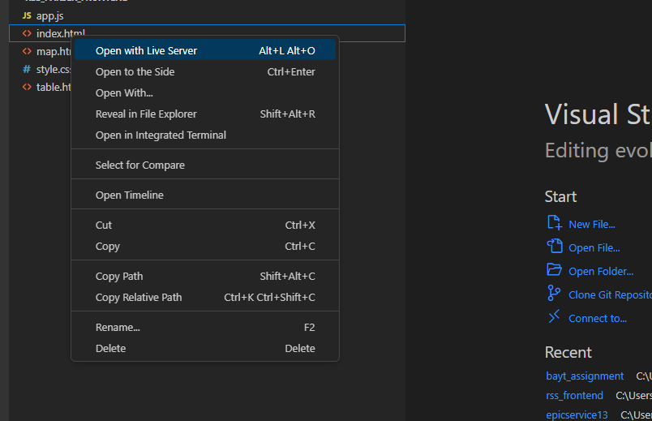
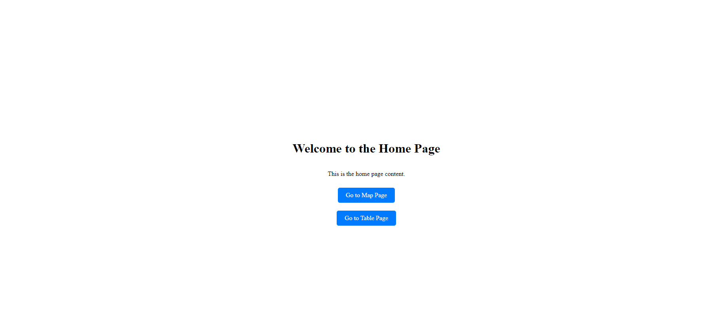
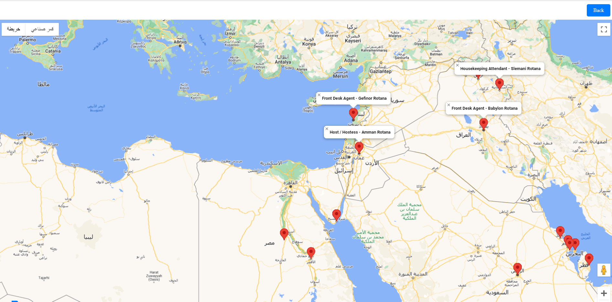
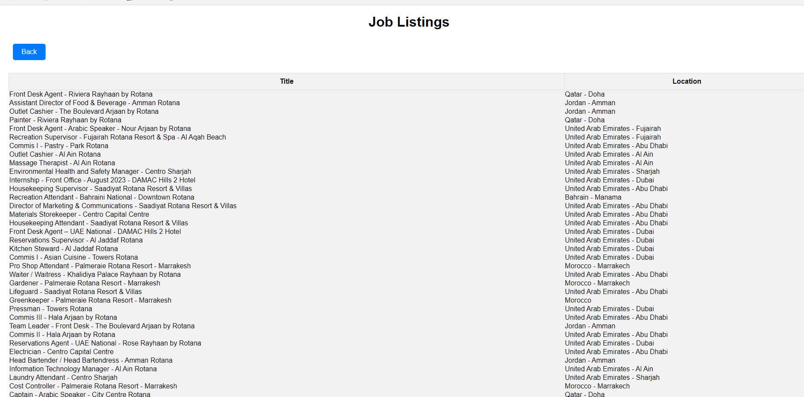

# Bayt Assignment
## Author : Lujain Al-Jarrah

## this assignment consisit of three part

* **first part** :you can find the solution in TCL_assessment . 
* **second part** : consist of Rss_parser_frontend and RSS_parser_backend.
* **third part** :you can find the solution in ER_diagram_assessment.


# For second Part(RSS Parser)
## for RSS_parser_backend

make sure you are in **\bayt_assignment\RSS_parser_backend**
1. Create a virtual environment (optional but recommended).
 *  ubunto user :
```
python -m venv .venv
source .venv/bin/activate
```
* windows terminal user :
```
Set-ExecutionPolicy -ExecutionPolicy Unrestricted -Scope Process
python -m venv .venv
.venv\Scripts\activate 
```

2. Installing the requirements
```
pip install -r requirement.txt
```

3.  Running the server

```
python manage.py runserver
```

### Login to the admin pannel
URL : http://127.0.0.1:8000/admin/

* user name : Lujain
* password : 1111

###  To check the API 

URL : http://127.0.0.1:8000/jobs/api/jobs/
 
## for rss_parser_frontend

make sure you are in **\bayt_assignment\rss_parser_frontend**
1. code .
2. index.hmtl file ,press right click and choose 'open with live server'


 # the final result


